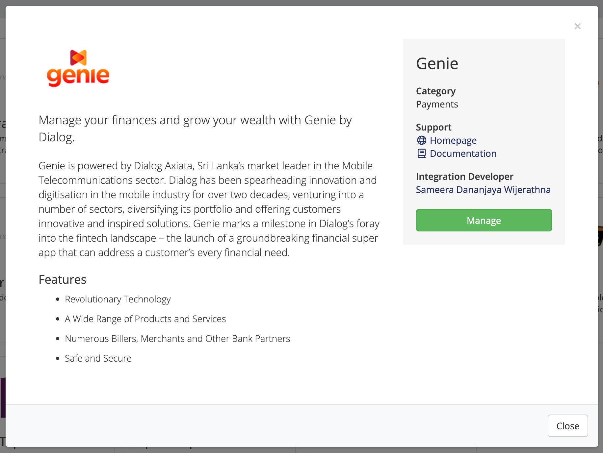
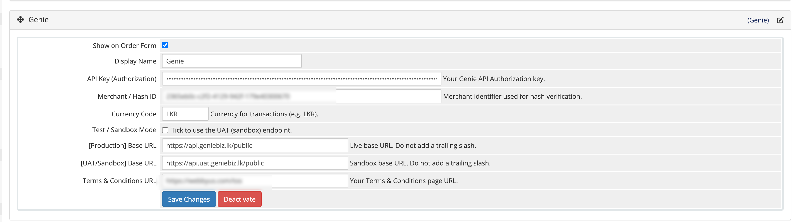

# WHMCS Genie Payment Gateway Module

A lightweight payment gateway module for WHMCS that integrates with the Genie Payment Gateway.




## Requirements

- WHMCS 7.0 or higher
- PHP 7.2 or higher
- cURL extension enabled
- Active Genie Payment Gateway Account

## Installation

1. Copy `genie.php` to `/modules/gateways/`
2. Copy `modules/gateways/callback/genie.php` to `/modules/gateways/callback/`
3. Set file permissions: `chmod 755 /modules/gateways/genie.php`

## Configuration

1. Log in to WHMCS Admin Panel
2. Navigate to Setup → Payment Gateways
3. Find "Genie Payment Gateway" and click "Activate"
4. Enter your Genie API credentials and configure settings

## Transaction Flow

```
Client selects Genie gateway at checkout
         ↓
   Redirect to Genie Payment Gateway
         ↓
     Complete Payment
         ↓
Callback verifies transaction with API
         ↓
  Invoice status updated automatically
```

## License

This project is licensed under a proprietary license. See [LICENSE](LICENSE) for details.

## Author

**Devage Don Sameera Dananjaya Wijerathna**

For inquiries or special permissions, contact: digix.sameera@yahoo.com
